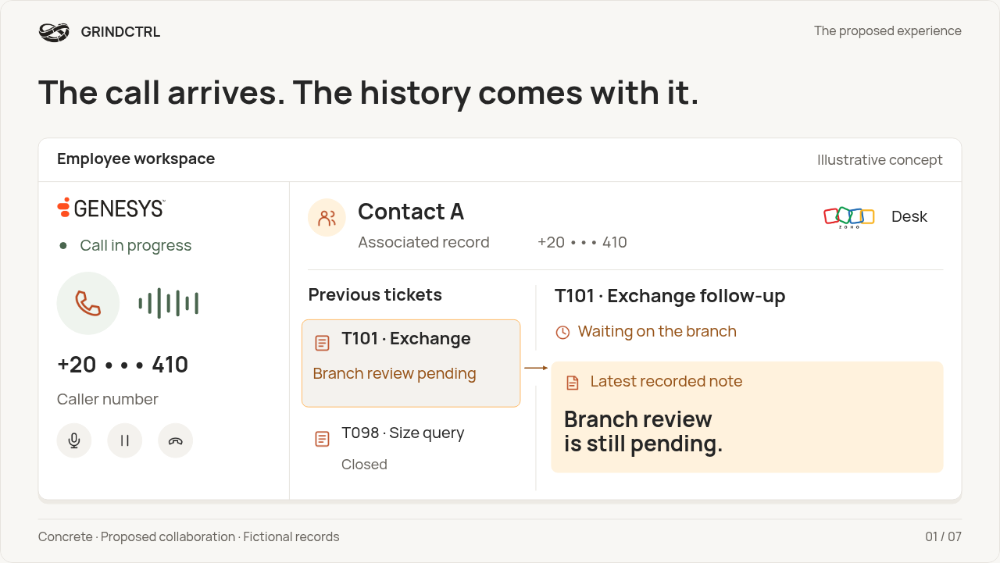
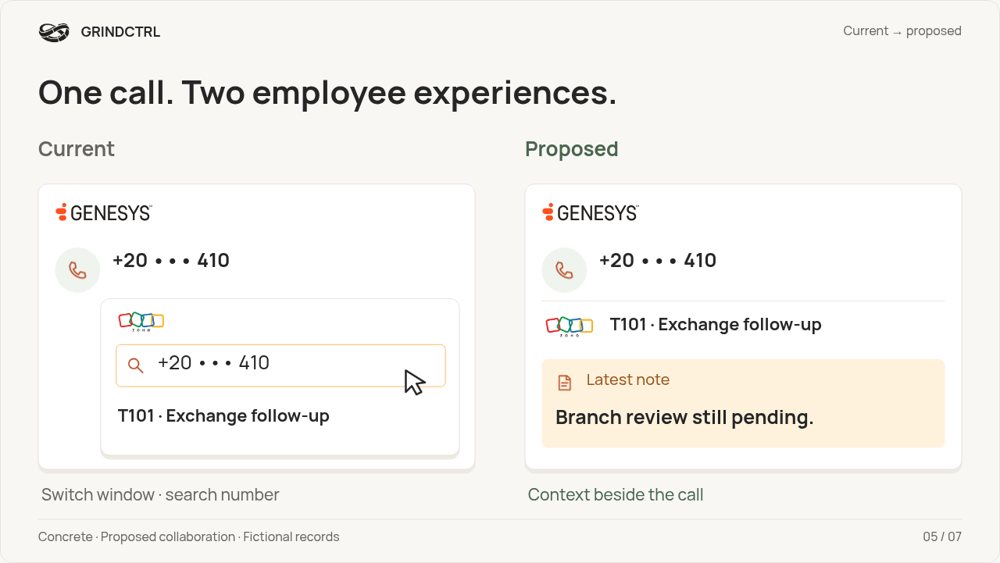
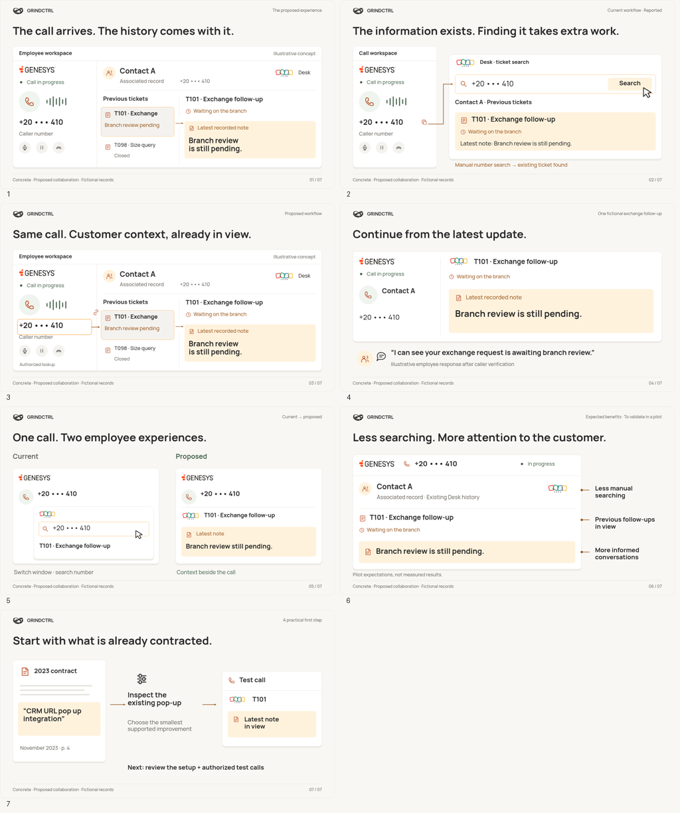
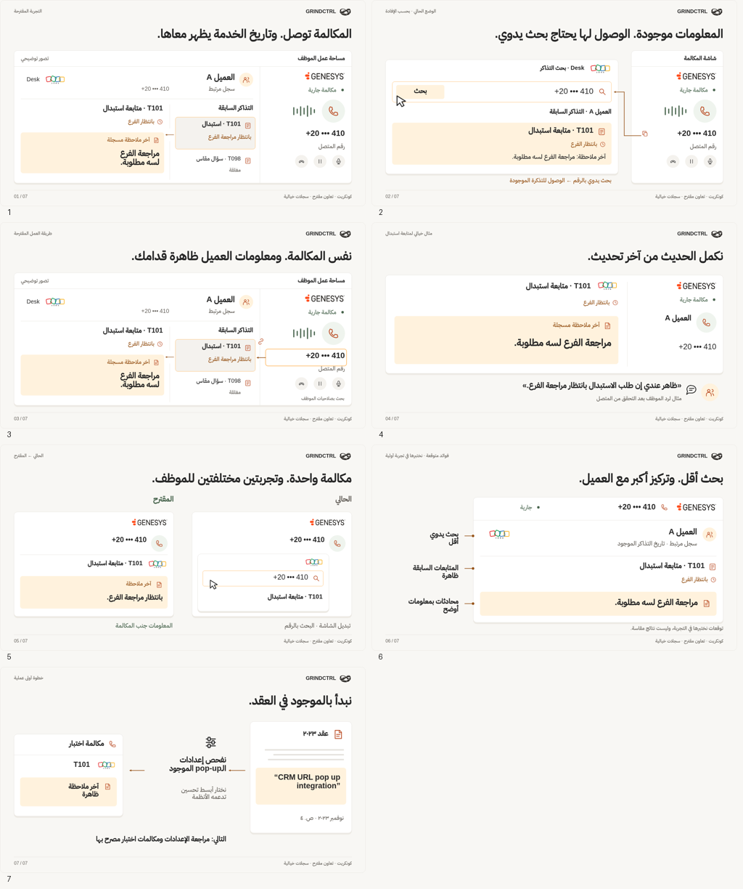

# GRINDCTRL × Concrete

A visual-first proposal in seven scenes. Start with the workspace and the before/after comparison below.

[Download the complete package](GRINDCTRL-Visual-First-Presentation.zip?raw=true) · [English PowerPoint](GRINDCTRL-Visual-First-English.pptx?raw=true) · [Arabic PowerPoint](GRINDCTRL-Visual-First-Arabic.pptx?raw=true)

[English PDF](GRINDCTRL-Visual-First-English.pdf) · [Arabic PDF](GRINDCTRL-Visual-First-Arabic.pdf) · [English video](GRINDCTRL-Visual-First-English.mp4?raw=true) · [Arabic video](GRINDCTRL-Visual-First-Arabic.mp4?raw=true)

[Download the interactive bilingual HTML](GRINDCTRL-Visual-First-Preview.html?raw=true), then open it in your browser. It works offline with pause, replay, next event and reduced-motion support. This is a presentation, not a hosted live integration.

## The seven scenes

## Arabic version

## Basis and review

Proposed first collaboration. All sample records are fictional. No claim of an existing GRINDCTRL implementation, live connector, measured savings or verified identity from a phone number. The first technical step is inspecting the URL pop-up scope already present in the 2023 contract. The core solution does not require generative AI.

[Research and design decisions](RESEARCH-AND-DIRECTION.md) · [Storyboard](STORYBOARD.md) · [Visual review](DESIGN-REVIEW.md) · [Validation](validation.json)

The supplied research sites were blocked in this environment. Accessible primary alternatives were read and documented; coverage is partial. No external participant testing was performed. Native PowerPoint was rendered and round-tripped using LibreOffice; Microsoft PowerPoint playback was not directly tested. Native effects are timed fades, not Morph. Font files, source and licenses are inside the ZIP.

This delivery branch contains presentation files only.
