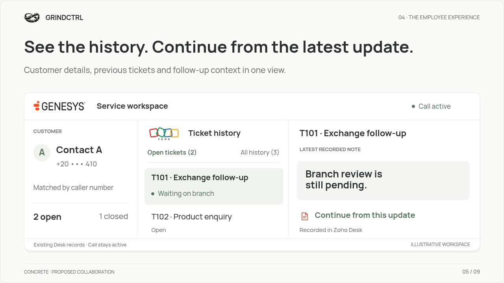

# GRINDCTRL — Customer context, with every call

A new nine-slide executive proposal for Concrete, redesigned in a premium light theme with a unified employee workspace, controlled typography and six-step call-to-context motion.

**[Download the complete presentation package](GRINDCTRL-Light-Presentation.zip)**

| Format | English | Arabic |
| --- | --- | --- |
| Editable PowerPoint | [Download](GRINDCTRL-Light-English.pptx) | [Download](GRINDCTRL-Light-Arabic.pptx) |
| Static PDF | [View / download](GRINDCTRL-Light-English.pdf) | [View / download](GRINDCTRL-Light-Arabic.pdf) |
| Animated walkthrough | [Watch / download](GRINDCTRL-Light-English.mp4) | [Watch / download](GRINDCTRL-Light-Arabic.mp4) |

[Offline bilingual interactive preview](GRINDCTRL-Light-Preview.html): download, then open in a browser. PowerPoint: use **Slide Show / From Beginning** to see the motion. The complete package includes editable source, fonts, licenses and validation notes.

On a GitHub file page, use **Download raw file**. To download this whole branch, choose **Code → Download ZIP**.

## The new design

[See all nine English slides](Overview-English.png) · [See all nine Arabic slides](Overview-Arabic.png)

## Scope

Proposed first collaboration; fictional illustrative records. The first improvement connects the caller with existing Zoho Desk service history. Live vendor integration is a future implementation step. AI summaries and management views are optional later capabilities. No measured ROI, savings or system latency is claimed.

Both languages were checked across laptop and mobile layouts, rendered as native PowerPoint slides, and exported as nine-page PDFs. Native entrance effects survived a LibreOffice round trip. Microsoft PowerPoint, Google Slides and Keynote playback was not directly tested; the browser preview and videos show the motion directly.

This branch contains the presentation delivery files. SHA256.json provides file checksums.
