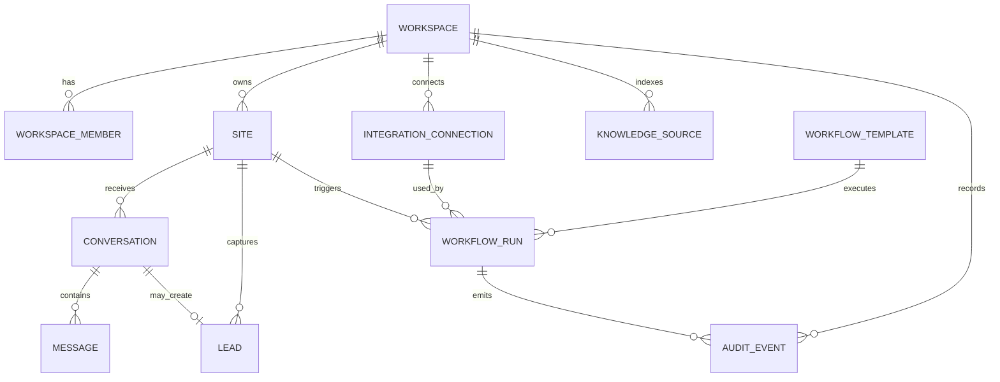
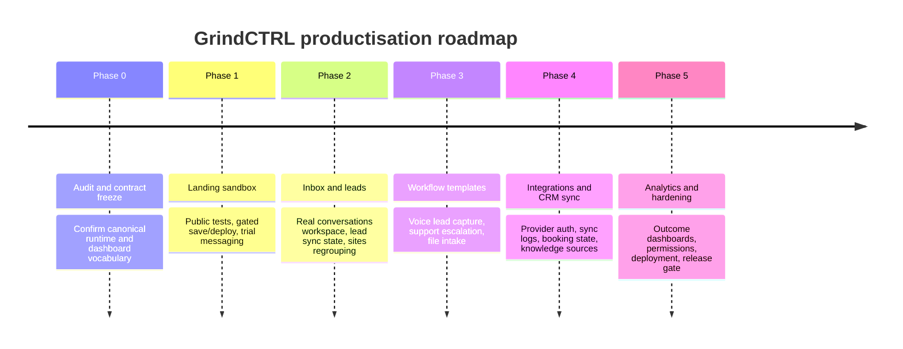

# GrindCTRL productisation blueprint

**Executive summary**

This research started from the enabled connectors—entity["company","GitHub","code hosting platform"] and entity["company","Supabase","backend platform"]—using the selected repository `mhhmod/grindctrl_booking`, then widened to official product and platform documentation where external category benchmarks or provider capabilities mattered. The highest-confidence conclusion is that GrindCTRL is already structurally close to a deployable AI operations product: the Next app in `apps/web-next` is a genuine dashboard shell, the landing page has already been repositioned away from “just a widget”, the dashboard has a usable navigation frame, and the repo already contains blueprint prompts, webhook contracts, and trial-style sandbox logic. What is still missing is not a fresh brand idea; it is a **controlled productisation pass** that turns the existing shell into a coherent offer built around support, service, leads, routing, integrations, and multimodal workflows. fileciteturn41file0L1-L1 fileciteturn4file0L1-L1 fileciteturn5file0L1-L1 fileciteturn6file0L1-L1

The landing page should therefore stop at one clear promise: **GrindCTRL helps businesses deploy AI workflows across conversations, voice, files, media, forms, and events, then route the output into customer support, customer service, lead qualification, and CRM-connected operations.** The dashboard should become the **control plane** for that system: inbox, leads, sites, routing, workflows, integrations, knowledge, analytics, and settings. The repo supports that direction, and the broader category supports it too: entity["company","Intercom","customer service software"], entity["company","Zendesk","customer service software"], and entity["company","HubSpot","crm software company"] all organise their value around conversations, context, handoff, external actions, and measurable outcomes rather than generic “AI models”. citeturn4search2turn4search6turn0search2

The information needs this report answers are these: the actual state of `apps/web-next`; the repo’s current workflow primitives and public-sandbox feasibility; the Supabase-backed domain objects already implied by the app; the exact landing-page tests that should convert visitors today; the full dashboard information architecture needed for productisation; and the execution roadmap for Codex and Claude Code to implement without uncontrolled scope drift.

## Current state

The current `apps/web-next` app is already the right production base. Its own README describes it as the GrindCTRL dashboard shell, built to sit on top of real Clerk authentication and real Supabase integrations rather than mock-only UI, while the public widget runtime stays outside React. In practice, that means the repo already separates the operator console from the runtime/embed layer, which is the correct architecture for a platform product. fileciteturn41file0L1-L1

The public landing page is already much closer to the desired brand than the older widget-first version. The current `app/page.tsx` positions GrindCTRL as an AI implementation and automation platform, with sections for capabilities, “how it works”, use cases, widget/embed as one module, and clear authentication calls to action. What it still lacks is a live, anonymous, structured proof surface that lets a visitor test one or two real business workflows before signing in. fileciteturn4file0L1-L1

The dashboard is no longer a blank shell. The current navigation and route metadata expose Overview, Conversations, Install, Branding, Intents, Domains, Leads, Workflows, Integrations, and Settings, which means the product already has a plausible operator topology. The placeholder pages for Conversations, Workflows, and Integrations are useful signposts, but they are not yet operating screens; by contrast, Overview, Install, and Leads already imply live data responsibilities and will need to become high-trust production pages rather than internal prototypes. fileciteturn5file0L1-L1 fileciteturn6file0L1-L1 fileciteturn23file0L1-L1 fileciteturn36file0L1-L1 fileciteturn42file0L1-L1 fileciteturn44file0L1-L1 fileciteturn7file0L1-L1 fileciteturn8file0L1-L1

The strongest evidence that GrindCTRL already has workflow DNA is in the older blueprint and contract files. The repo includes an n8n contract document that standardises event-style envelopes such as `conversation_start`, `message_sent`, `escalation_trigger`, `trial_warning`, `branding_change`, and `usage_threshold`, plus the assistant-message response path. It also includes blueprint prompts for `qualify_leads`, `customer_support`, `generate_reports`, `book_meetings`, and `follow_up`, which means the repo already has business-oriented task archetypes rather than only generic prompts. The older blueprint studio script also contains concrete sandbox-like constraints and webhook-style endpoints for text and voice flows. That combination is exactly the raw material needed for the landing-page demo system and the first workflow templates. fileciteturn27file0L1-L1 fileciteturn35file0L1-L1 fileciteturn32file0L1-L1

At the data-contract level, the app is already organised around a unified `WidgetSite` / `settings_json` configuration pattern rather than scattered per-screen settings. The site adapter and types indicate that branding, widget behaviour, leads, routing, and security are expected to resolve through a single site settings surface, which is exactly the right abstraction for v1. It means the UI can remain business-friendly while workflows and providers change underneath. fileciteturn21file0L1-L1 fileciteturn43file0L1-L1

From the live connector inspection performed in this session, the active Supabase project is **GrindCTRL (v1)**, and the live inventory includes the tables and edge-function surfaces you expected to inspect: `workspaces`, `workspace_members`, `widget_sites`, `widget_leads`, `widget_events`, `widget_conversations`, `widget_messages`, `knowledge_sources`, and the `widget-config`, `widget-conversation`, and `widget-message` function surfaces. Those live-object confirmations came from the connector rather than a line-addressable repo file, so they cannot be rendered here as `filecite` links; where possible, I anchor the product decisions below to the repo files that already imply the same model. The practical implication is that the app is not a greenfield dashboard: it is a partly-real operator console that now needs consistent product boundaries.

One important limitation remains: the exact workflow named **“Voice Lead Capture - Groq to Google Sheets”** did not surface as a repo file during the repository scan. The closest confirmed artefacts are the existing `ai-blueprint`/voice webhook approach and the `qualify_leads` prompt family. That means the workflow should be treated as a **first-class template to formalise now**, not as an already-finished canonical asset. fileciteturn32file0L1-L1 fileciteturn35file0L1-L1

## Landing-page blueprint

The landing page should be laid out as a buyer journey, not as a catalogue of modalities. The page should help a visitor understand outcomes, try one real task, sign in only when they want to save or deploy, and then discover the dashboard as the control plane. That is the same pattern the best current customer-service and AI-ops products use: show value through a real interaction, then attach it to routing, handoff, and operations. citeturn4search0turn4search1turn4search6

The exact section order I recommend is this:

| Section | Purpose | Notes |
|---|---|---|
| Hero | Promise AI operations for support, service, leads, and automation | Keep outcome-led copy; avoid “LLM company” framing |
| Public sandbox | Let the visitor run 2–3 real multimodal tests | This is the missing conversion layer |
| Workflow gallery | Show production-ready templates | Voice Lead Capture, Support Escalation, File Intake, Ops Digest |
| Input → action map | Show all modality variants as business outputs | Use the matrix below, but present as actions not taxonomy |
| Integration proof | Show CRM, Google Workspace, APIs, storage, and messaging connectivity | Keep realistic, avoid fake logos if not verified |
| Governance and trust | Show handoff, audit trail, team control, and analytics | Essential for business credibility |
| Final CTA | Sign up to save, deploy, connect systems, and start the trial | Clear difference between anonymous and signed-in value |

The landing page should include three anonymous sandbox tests from day one. A good visitor should be able to complete the first test in under one minute, and every test should return a **structured business artefact**, not a chat reply.

### Public sandbox tests

| Test | Input UI | Visitor sees before login | What login unlocks |
|---|---|---|---|
| Workflow planner | Free-text textarea | Workflow summary, inputs, outputs, recommended template, suggested integrations | Save blueprint, edit steps, deploy, connect tools |
| Voice lead capture | Microphone/upload | Transcript, extracted lead fields, intent, score, proposed next action | Save lead, push to CRM/Sheets, booking CTA, history |
| File or image intake | File/image upload | Extracted fields, summary, classification, recommended workflow | Persist result, send report, create tasks, connect storage |

Those tests are feasible today because the repo already contains the behavioural ingredients: blueprint prompts for outcome categories, webhook-style routing, and sandbox-like request limits in the legacy blueprint experience. fileciteturn35file0L1-L1 fileciteturn32file0L1-L1

### Input-to-output map for the landing page

| Input | Priority outputs for v1 | Best demo priority |
|---|---|---|
| Text | Voice reply, image summary, structured workflow plan, CRM note, email draft | High |
| Voice | Transcript, summary, lead object, ticket draft, booking suggestion | Highest |
| Image | Description, extracted details, classification, task creation, CRM note | High |
| Video | Transcript, summary, clip markers, incident/support report | Medium |
| File | Summary, extracted entities, spreadsheet row, approval decision | Highest |
| Form | Score, routing, CRM update, call booking, follow-up draft | Highest |
| Event/API | Task, notification, workflow run, dashboard update | High |

### Expected structured output contracts for the public tests

**Workflow planner — sample output**
```json
{
  "status": "completed",
  "workflow_type": "support_intake",
  "summary": "Capture website enquiries, classify intent, answer simple questions, escalate billing issues, sync leads to CRM.",
  "recommended_modules": ["widget", "routing", "knowledge", "crm_sync"],
  "suggested_integrations": ["hubspot", "google_sheets", "gmail"],
  "estimated_setup_steps": 5,
  "next_action": "sign_in_to_save_blueprint"
}
```

**Voice lead capture — sample output**
```json
{
  "status": "completed",
  "channel": "voice",
  "transcript": "Hi, I'm Sarah from Bright Dental. We need an AI assistant for missed calls and lead capture.",
  "lead": {
    "name": "Sarah",
    "company": "Bright Dental",
    "need": "missed calls and lead capture",
    "priority": "high",
    "score": 84
  },
  "recommended_workflow": "voice_lead_capture",
  "next_action": "sign_in_to_save_and_sync"
}
```

**File or image intake — sample output**
```json
{
  "status": "completed",
  "document_type": "invoice",
  "summary": "Invoice extracted successfully with vendor, total, due date and reference number.",
  "extracted_entities": {
    "vendor": "Acme Services",
    "total": 1450.00,
    "currency": "GBP",
    "due_date": "2026-05-12",
    "invoice_number": "INV-2026-0841"
  },
  "recommended_workflow": "file_intake_automation",
  "next_action": "sign_in_to_export_or_route"
}
```

The UI interaction model should be visibly staged. First, the visitor chooses a test; second, they submit input; third, they see a structured output card; fourth, they are offered **one gated action**—save, deploy, sync, or connect. That pattern is far better than forcing login before any value or, at the other extreme, running expensive actions anonymously.

For modality messaging, the page should use the user’s matrix, but translate it into operational language. Instead of “text-to-image, image-to-text, text-to-video” as the core story, use copy such as: “Turn a voice note into a qualified lead”, “Turn a file into extracted data and routing”, “Turn a conversation into a CRM update”, “Turn an uploaded video into a timestamped report”. That keeps multimodality visible while grounding it in business outcomes.

## Dashboard full app spec

The current dashboard frame is useful, but its top-level groupings still reflect implementation slices. Productisation should reorganise it around one operator mental model: **inbox, leads, sites, routing, workflows, integrations, knowledge, analytics, settings**. The current route map gives you enough to make that transition without a rewrite. fileciteturn5file0L1-L1 fileciteturn6file0L1-L1

### Recommended navigation

| Recommended module | Current state in repo | Responsibility |
|---|---|---|
| Overview | Present | Workspace health, deployment status, volumes, conversion, usage |
| Inbox | Current “Conversations” placeholder | Unified conversation workspace with summaries, handoff, response, audit |
| Leads | Present | Lead capture, qualification, owner, sync state, booking state |
| Sites | Derived from Install + Branding + Domains | Domain install, brand, widget config, verification, channel settings |
| Routing | Current “Intents” | Classification, escalation rules, priority logic, human handoff |
| Workflows | Placeholder | Template library, run history, logs, retries, approvals |
| Integrations | Placeholder | CRM, Google, email, storage, telephony, webhooks, credentials |
| Knowledge | New | Knowledge sources, indexing, freshness, grounding rules |
| Analytics | Evolve from Overview and events | Funnel, resolution, automation rate, lead conversion, workflow outcomes |
| Settings | Placeholder | Team, RBAC, billing, API keys, limits, audit controls |

This layout mirrors how current service platforms organise the operator experience: a shared inbox, context-rich records, routing, and clear handoff states. citeturn4search0turn4search1turn4search6

### Core dashboard data objects

| Object | Required fields for v1 | Why it matters |
|---|---|---|
| Workspace | `id`, `name`, `plan`, `trial_status`, `trial_ends_at`, `usage_limits`, `owner_id` | Top-level ownership and billing boundary |
| WorkspaceMember | `workspace_id`, `user_id`, `role`, `permissions`, `status` | Team and RBAC |
| Site | `id`, `workspace_id`, `name`, `domain`, `install_status`, `settings_json`, `settings_version` | Deployable AI surface |
| Conversation | `id`, `site_id`, `channel`, `source`, `status`, `customer_ref`, `summary`, `sentiment`, `assigned_to`, `handoff_state`, `started_at`, `updated_at` | Central inbox object |
| Message | `id`, `conversation_id`, `role`, `modality`, `text`, `file_refs`, `voice_ref`, `model_ref`, `created_at` | Message-level replay and audit |
| Lead | `id`, `site_id`, `conversation_id`, `name`, `email`, `phone`, `company`, `need`, `score`, `stage`, `owner_id`, `crm_sync_status`, `booking_status`, `source` | Qualification and CRM handoff |
| WorkflowTemplate | `id`, `slug`, `name`, `category`, `input_modalities`, `actions`, `requires_approval`, `published_version` | Managed automation catalogue |
| WorkflowRun | `id`, `template_id`, `trigger_type`, `input_ref`, `status`, `summary`, `confidence`, `executed_actions`, `error`, `started_at`, `ended_at` | Observability and retries |
| IntegrationConnection | `id`, `workspace_id`, `provider`, `status`, `scopes`, `last_sync_at`, `error_state` | CRM/Google/API ops |
| KnowledgeSource | `id`, `workspace_id`, `type`, `title`, `uri`, `index_status`, `freshness_state`, `last_indexed_at` | Support/service grounding |
| AuditEvent | `id`, `workspace_id`, `actor_type`, `actor_id`, `event_type`, `entity_type`, `entity_id`, `payload`, `created_at` | Trust and enterprise readiness |

The current repo already implies a large part of this model through `WidgetSite`, the site adapter, event analytics on Overview, and the specialised Leads / Install pages. The product decision is not to invent a new object model; it is to **elevate the existing site/conversation/lead model into a coherent app vocabulary**. fileciteturn21file0L1-L1 fileciteturn23file0L1-L1 fileciteturn36file0L1-L1 fileciteturn42file0L1-L1 fileciteturn43file0L1-L1

### RBAC notes

Today’s policy shape is good enough for view-level navigation, but productisation needs action-level permissions. The roles should be **Owner**, **Admin**, **Manager**, **Agent**, and **Viewer**. The permission set should be explicit and action-oriented: `sites.manage`, `routing.manage`, `conversations.reply`, `conversations.assign`, `leads.manage`, `workflows.run`, `workflows.publish`, `integrations.manage`, `knowledge.manage`, `analytics.read`, `billing.manage`, and `audit.read`. The reason to do this early is that CRM sync, external actions, and human handoff all become dangerous if permissions stay nav-only.

### Workflow-to-dashboard entity relationships

The full app should revolve around the following relationship model:



That structure matches both the repo’s current shape and the way modern service platforms attach conversations to routing, actions, and outcomes. fileciteturn23file0L1-L1 fileciteturn42file0L1-L1 citeturn4search0turn4search6turn4search1

## Workflow catalogue

The repo already gives two strong design signals for workflows: first, the n8n contract style is **event-envelope based**; second, the blueprint prompt set is **business outcome based** rather than modality-first. The v1 workflow catalogue should therefore be expressed as a small library of opinionated templates, each with a standard output envelope and a standard logging model. fileciteturn27file0L1-L1 fileciteturn35file0L1-L1 citeturn3search4turn3search10

### Standard output envelope for all workflows

```json
{
  "status": "completed | needs_human | failed",
  "workflow_slug": "string",
  "summary": "string",
  "confidence": 0.0,
  "extracted_entities": {},
  "decision": {
    "route": "string",
    "priority": "low | medium | high",
    "handoff_required": false
  },
  "executed_actions": [],
  "external_refs": [],
  "observability": {
    "provider_refs": [],
    "latency_ms": 0,
    "cost_estimate": 0
  }
}
```

### Voice Lead Capture

| Element | Spec |
|---|---|
| Trigger | Widget voice note, upload, or telephony transcript event |
| Input schema | `audio_ref`, `duration_sec`, `site_id`, `channel`, `locale`, optional `caller_id` |
| Enrichment | Speech-to-text, speaker clean-up, entity extraction, lead scoring, duplicate check, company inference |
| Decision logic | Is this a lead, support request, or low-quality spam? If lead, score and route; if support, reclassify to support workflow |
| Actions | Create/update lead, sync to CRM or Google Sheets, optionally create booking prompt or sales follow-up |
| Observability | Transcript quality, extracted fields confidence, scoring rationale, sync status, booking conversion |
| Notes | This should be the flagship landing-page and dashboard template |

**Sample webhook payload**
```json
{
  "event": "voice_lead_capture.requested",
  "workspace_id": "ws_123",
  "site_id": "site_123",
  "input": {
    "audio_ref": "file_abc",
    "duration_sec": 22,
    "locale": "en-GB",
    "source": "landing_sandbox"
  }
}
```

### Support Answer and Escalation

| Element | Spec |
|---|---|
| Trigger | Chat message, email-style message, uploaded troubleshooting file, or voice transcript |
| Input schema | `conversation_id`, `message_text`, optional `attachments[]`, `customer_ref`, `site_id` |
| Enrichment | Intent detection, sentiment, knowledge lookup, order/account fetch if configured |
| Decision logic | If confidence high and escalation rules clear, answer; if low confidence, frustration, policy edge case, or request for human, hand off |
| Actions | Send answer, create ticket/task, assign queue, append summary for human agent |
| Observability | Resolution attempt, confidence, escalation cause, time-to-answer, final disposition |
| Notes | This is the core “customer support” workflow |

**Sample webhook payload**
```json
{
  "event": "support_answer.requested",
  "conversation_id": "conv_123",
  "site_id": "site_123",
  "input": {
    "message_text": "My order arrived damaged and I need a refund.",
    "attachments": ["img_damage_01"]
  }
}
```

### Form Lead Qualification

| Element | Spec |
|---|---|
| Trigger | Widget lead form, website form, or API form event |
| Input schema | `name`, `email`, `phone`, `company`, `message`, `source`, `site_id` |
| Enrichment | Company/domain enrichment, intent extraction, score, territory mapping |
| Decision logic | Decide sales priority, owner, and whether to prompt immediate booking |
| Actions | CRM create/update, email draft, call booking suggestion, internal alert |
| Observability | Form conversion, score distribution, sync latency, booking rate |
| Notes | This should share scoring logic with voice lead capture |

### File Intake Automation

| Element | Spec |
|---|---|
| Trigger | PDF, spreadsheet, image, or document upload |
| Input schema | `file_ref`, `mime_type`, `source`, `workspace_id`, optional `expected_schema` |
| Enrichment | OCR/parse if needed, entity extraction, schema mapping, anomaly detection |
| Decision logic | Decide whether to route to finance, ops, support, or archive; decide whether human approval is required |
| Actions | Create spreadsheet row, issue report, send email, open approval task |
| Observability | Parse success, extraction completeness, validation failures, approval wait time |
| Notes | Core “operations AI” workflow |

### Image Inspection

| Element | Spec |
|---|---|
| Trigger | Image upload or incoming message attachment |
| Input schema | `image_ref`, `site_id`, `context_type`, optional `inspection_policy` |
| Enrichment | Captioning, object/issue detection, structured form extraction |
| Decision logic | Is the image informative enough? Is escalation required? Is a claim/warranty path involved? |
| Actions | Add issue note, create support task, draft response, attach findings to CRM or ticket |
| Observability | Vision confidence, issue class, human override rate |
| Notes | Useful for returns, field service, onboarding, and content moderation-lite |

### Video Intelligence

| Element | Spec |
|---|---|
| Trigger | Video upload, call recording, or stored media reference |
| Input schema | `video_ref`, `duration_sec`, `source`, `workspace_id` |
| Enrichment | Transcript, timestamped summary, entity extraction, incident/highlight markers |
| Decision logic | Decide whether to summarise only, create clips, escalate, or route to review |
| Actions | Create report, post summary, extract clips, create support or ops task |
| Observability | Processing time, token/cost use, summary quality, event markers |
| Notes | Better as signed-in or paid usage than anonymous-first because cost and latency are higher |

### Scheduled Ops Digest

| Element | Spec |
|---|---|
| Trigger | Schedule trigger or external event/API |
| Input schema | `workspace_id`, `date_range`, `sources[]`, `digest_type` |
| Enrichment | Aggregate workflow runs, leads, conversations, sync failures, unresolved issues |
| Decision logic | Decide which anomalies, wins, or actions to highlight |
| Actions | Email digest, dashboard update, manager task batch, spreadsheet or CRM note |
| Observability | Delivery success, action completion rate, anomaly recall |
| Notes | Best for operations managers and founders |

### Sample n8n-compatible contract style

The current repo contract style should be extended rather than replaced. A multimodal workflow invocation should look like this:

```json
{
  "event": "workflow.requested",
  "workflow_slug": "voice_lead_capture",
  "workspace_id": "ws_123",
  "site_id": "site_123",
  "source": "dashboard | widget | landing_sandbox | API",
  "input": {
    "modality": "voice",
    "audio_ref": "file_abc"
  },
  "context": {
    "conversation_id": "conv_123",
    "customer_ref": "cust_987",
    "locale": "en-GB"
  }
}
```

The external response should keep the same discipline:

```json
{
  "event": "workflow.completed",
  "workflow_slug": "voice_lead_capture",
  "status": "completed",
  "summary": "Qualified inbound lead captured and synced.",
  "confidence": 0.91,
  "extracted_entities": {
    "name": "Sarah",
    "company": "Bright Dental"
  },
  "executed_actions": [
    {"type": "google_sheets.append", "status": "completed"},
    {"type": "crm.upsert", "status": "completed"}
  ],
  "external_refs": [
    {"system": "google_sheets", "id": "row_881"},
    {"system": "crm", "id": "lead_442"}
  ]
}
```

### Files and folders to change

| File or folder | Current purpose | Proposed change | Why | Risk | Phase |
|---|---|---|---|---|---|
| `apps/web-next/app/page.tsx` | Current branded landing page shell fileciteturn4file0L1-L1 | Add live public sandbox, workflow gallery, and gated save/deploy actions | Biggest conversion gap | Medium | Phase 1 |
| `apps/web-next/app/layout.tsx` | App metadata and shell | Refine metadata for sandbox and SEO | Align with live demo positioning | Low | Phase 1 |
| `apps/web-next/app/dashboard/conversations/page.tsx` | Placeholder inbox page fileciteturn44file0L1-L1 | Build real inbox list/detail view | Core support/service module | Medium | Phase 2 |
| `apps/web-next/app/dashboard/leads/page.tsx` | Current leads screen foundation fileciteturn42file0L1-L1 | Expand qualification, sync, booking, owner state | Core sales/CRM value | Medium | Phase 2 |
| `apps/web-next/app/dashboard/install/page.tsx` | Install surface for widget/site deployment fileciteturn36file0L1-L1 | Fold into a “Sites” model, likely via tabs | Simplifies IA | Low | Phase 2 |
| `apps/web-next/app/dashboard/workflows/page.tsx` | Placeholder workflow catalogue fileciteturn7file0L1-L1 | Add template cards, run history, output viewer | Product heart | Medium | Phase 3 |
| `apps/web-next/app/dashboard/integrations/page.tsx` | Placeholder integrations view fileciteturn8file0L1-L1 | Add connection cards, auth status, sync diagnostics | Required for CRM value | Medium | Phase 4 |
| `apps/web-next/lib/dashboard/nav-config.ts` | Current sidebar structure fileciteturn5file0L1-L1 | Reframe to Overview / Inbox / Leads / Sites / Routing / Workflows / Integrations / Knowledge / Analytics / Settings | Better operator language | Low | Phase 2 |
| `apps/web-next/lib/dashboard/route-meta.ts` | Route descriptions and titles fileciteturn6file0L1-L1 | Update module descriptions to business outcomes | Consistency | Low | Phase 2 |
| `apps/web-next/lib/types.ts` | Current domain types, including site settings fileciteturn21file0L1-L1 | Add explicit workflow, run, integration, and knowledge types | Needed for product coherence | Medium | Phase 3 |
| `apps/web-next/lib/adapters/widgetSites.ts` | Site settings adapter fileciteturn43file0L1-L1 | Extend for site tabs and richer settings reads | Needed for “Sites” consolidation | Medium | Phase 2 |
| `supabase/dashboard_rpc_functions.sql` | Existing dashboard RPC contract | Add or formalise workflow, inbox, lead-sync, and analytics RPCs | Backend support for new pages | Medium | Phase 3–5 |
| `widget-n8n-contracts.md` | Existing event-envelope contract fileciteturn27file0L1-L1 | Extend for workflow invocation/completion events | Keep one transport style | Low | Phase 3 |
| `groq-blueprint-prompts.md` | Business blueprint prompt definitions fileciteturn35file0L1-L1 | Promote into dashboard templates catalogue | Converts hidden capability into product | Low | Phase 3 |
| `apps/web-next/docs/deployment.md` | Deployment guide for Next app on VPS fileciteturn73file0L1-L1 | Update once final release-gate decisions are approved | Production cleanliness | Low | Phase 5 |
| `.github/workflows/static.yml` | Legacy root-app deployment path fileciteturn63file0L1-L1 | Scope to root legacy paths only | Avoid accidental legacy deploys | Medium | Phase 5 |

## Trial and sandbox policy

The right policy for GrindCTRL is **free public taste, then signed-in time-based trial**. An hours-only trial is too short for a business buyer who needs to set up a domain, deploy a widget, connect systems, invite teammates, and validate routing. The current market norm for serious service tools is a 14-day, no-card trial, while freemium products tend to use permanently free but heavily limited models. For GrindCTRL, a 14-day signed-in trial is the better fit because the product is operational, integration-heavy, and potentially usage-costly. citeturn0search0turn0search6turn0search2

The anonymous sandbox should remain tight. The legacy blueprint studio limits already show sound instincts: a few turns, capped anonymous sessions, short audio, bounded message length, and very limited image-generation actions. GrindCTRL should preserve that logic in the Next landing page. fileciteturn32file0L1-L1

### Recommended policy

| Layer | Policy |
|---|---|
| Anonymous public sandbox | 3 workflow runs per 24h; max 30s audio; max 1 small file/image per run; no persistent save; no external side effects; no video generation |
| Signed-in trial | 14 days; one workspace; one live site; one verified domain; one widget; capped workflow executions; limited media credits; CRM/Sheets sync enabled |
| Paid starter | Unlock persistent runs, more workflows, more sites, more integrations, longer history |
| Media policy | Image generation modestly capped in trial; video understanding allowed with limits; video generation heavily capped or paid-only because cost is materially higher | 

That video policy matters because the external provider economics are still meaningfully higher for generated video than for text, voice, or file summarisation. entity["company","Runway","generative media company"] documents text-to-video, image-to-video, and video-to-video support, but its API pricing remains per-second and noticeably more expensive than standard text or low-cost image interactions, which makes anonymous or overly generous trial usage a poor business decision. citeturn5search0turn5search3turn5search4

By contrast, the text, voice, and image flows you want are operationally credible today. entity["company","OpenAI","ai company"] documents speech-to-text, text-to-speech, and image generation/editing; entity["company","Google","technology company"] documents image and video understanding in Gemini; and entity["company","n8n","workflow automation platform"] documents tool-oriented AI-agent workflows that can orchestrate those providers inside business automations. That is exactly why GrindCTRL should promise multimodal workflows, but launch with carefully-chosen anonymous and trial quotas rather than “everything unlimited”. citeturn2search2turn2search4turn1search0turn2search1turn2search3turn3search4

## CI/CD and deployment checklist

The deployment architecture is already substantially settled: `apps/web-next` is the production app, the deployment guide positions the app behind entity["company","Hostinger","web hosting company"] DNS/VPS and Nginx, and the Next app is configured for standalone output, which is the correct production target for a VPS-hosted Next server. The immediate job is therefore not to invent new deployment machinery; it is to tighten the release gate and ensure the legacy root app cannot accidentally keep winning the deployment race. fileciteturn73file0L1-L1 fileciteturn52file0L1-L1 fileciteturn61file0L1-L1

### Build and run commands

```bash
cd apps/web-next
npm ci
npm run build
npm run start
```

These are the commands the repo architecture already implies for a Next standalone deployment. fileciteturn61file0L1-L1

### Environment variables

| Variable | Scope | Notes |
|---|---|---|
| `NEXT_PUBLIC_APP_URL` | Public | Base URL for the web app |
| `NEXT_PUBLIC_CLERK_PUBLISHABLE_KEY` | Public | Clerk browser key |
| `CLERK_SECRET_KEY` | Secret | Server-side Clerk secret |
| `NEXT_PUBLIC_SUPABASE_URL` | Public | Supabase project URL |
| `NEXT_PUBLIC_SUPABASE_ANON_KEY` | Public | Browser-safe anon key |
| `SUPABASE_SERVICE_ROLE_KEY` | Secret | Only if a server-side function truly requires it; never expose publicly |
| `N8N_WEBHOOK_MESSAGES` | Secret/server config | Keep server-side |
| `N8N_WEBHOOK_CONVERSATIONS` | Secret/server config | Keep server-side |
| Provider API keys | Secret | OpenAI, Gemini, Groq, Runway, CRM, email, etc. must remain server-only |

### Nginx and VPS checklist

| Item | Why |
|---|---|
| Confirm `/root/grindctrl-next/deploy-next.sh` exists | The current deployment guide and workflow assumptions depend on it |
| Confirm Node and PM2 versions on VPS | Avoid runtime drift |
| Confirm Nginx reverse proxy to the Next server port | Required for SSL and clean domain routing |
| Confirm SSL for apex and `www` | Production trust and redirect consistency |
| Confirm DNS points to the VPS, not legacy GitHub Pages | Avoid split serving |
| Confirm environment file on the VPS contains live Clerk and Supabase values | Prevent broken auth/runtime |

The deployment guide expressly treats `/root/grindctrl-next/deploy-next.sh` as a required part of the VPS chain, so its presence is a release blocker rather than a nice-to-have. fileciteturn73file0L1-L1

### GitHub Actions recommendation

The legacy `.github/workflows/static.yml` should be scoped to the legacy root-app paths only, so that `apps/web-next` changes do not trigger the old static deployment path. That is the safest minimal change because the repo still contains both eras of the product, and the wrong workflow firing on `main` would create costly ambiguity. The release-gate branch should therefore either add a minimal `paths:` filter to `static.yml` or formally disable the workflow if the root app is now permanently archival. fileciteturn63file0L1-L1 fileciteturn73file0L1-L1

## Implementation roadmap and actionable prompts

The roadmap should stay intentionally narrow. Do not let Codex or Claude Code “keep going” into generic feature expansion. The right path is a phased productisation programme in which frontend experience and backend contract hardening move together.

### Roadmap timeline



### Phase plan

| Phase | Goal | Files likely touched | Acceptance criteria | Rollback note |
|---|---|---|---|---|
| Phase 0 | Freeze canonical product model and contract surfaces | `lib/types.ts`, `widget-n8n-contracts.md`, internal planning docs, no prod code if possible | One agreed vocabulary for site / conversation / lead / workflow / integration / knowledge | Easy rollback because this is mostly planning/spec |
| Phase 1 | Build landing-page sandbox and trial gate | `app/page.tsx`, `app/layout.tsx`, optional new sandbox components, server action/API handler files | Visitor can run public tests, see structured outputs, then sign in to save/deploy | Keep old hero sections behind a feature flag or temporary branch |
| Phase 2 | Turn dashboard into a real operator surface | `app/dashboard/conversations/page.tsx`, `app/dashboard/leads/page.tsx`, `app/dashboard/install/page.tsx`, `lib/dashboard/nav-config.ts`, `lib/dashboard/route-meta.ts`, adapters | Inbox and Leads work with real status/filter logic; Sites regrouped coherently | Preserve current pages behind route aliases if needed |
| Phase 3 | Ship workflow templates and run history | `app/dashboard/workflows/page.tsx`, `lib/types.ts`, workflow adapters, `widget-n8n-contracts.md`, prompt files, RPC/edge function support | Three core templates run end-to-end and log outputs consistently | Keep templates read-only until execution stabilises |
| Phase 4 | Add integrations, CRM sync, knowledge | `app/dashboard/integrations/page.tsx`, new Knowledge pages, provider adapters, relevant Supabase contracts | Connected providers show status; lead sync and knowledge status visible | Treat integrations as disabled-by-default until provider auth is verified |
| Phase 5 | Harden analytics, RBAC, and deployment | Overview/Analytics pages, policy files, workflow logs, deployment docs, GitHub Actions | Role-safe operations, meaningful analytics, clean deployment chain | Leave legacy workflow files untouched until paths scoping is validated |

### Exact division of labour

**Codex should own** UI composition, component refactors, navigation/IA work, public sandbox rendering, dashboard lists/detail pages, output cards, filters, run-history screens, provider connection cards, and carefully scoped GitHub workflow/documentation changes.

**Claude Code should own** data contracts, server actions, RPC proposals, edge-function work, webhook contract extensions, provider execution logic, dedupe/scoring rules, sync logic, audit events, and release-safety validation around Supabase and deployment. Claude Code should not invent new IA or broad visual changes if those have already been decided.

### Phase 1 implementation prompt for Codex

```text
You are working in mhhmod/grindctrl_booking.

Scope: Phase 1 only — landing-page public sandbox in apps/web-next.

Do not change Supabase schema, edge functions, Clerk auth, middleware, or dashboard pages.
Do not add dependencies unless absolutely necessary and justified.
Do not touch the root legacy Vite app.

Goal:
Turn the current landing page into a product-led conversion page with 3 anonymous sandbox tests:
1. Workflow planner
2. Voice lead capture
3. File/image intake

Requirements:
- Keep the current premium dark design direction.
- Preserve existing hero, capabilities, and CTA structure where useful.
- Add a “Try GrindCTRL” section above the fold or immediately below the hero.
- Each test must return a structured result card, not a generic chat transcript.
- Anonymous users can run the test but cannot save, deploy, sync, or export.
- Signed-in CTA appears only after result generation.
- Add clear trial messaging: 14-day trial, no anonymous persistence, external actions require sign-in.

Allowed areas:
- apps/web-next/app/page.tsx
- apps/web-next/app/layout.tsx
- new UI components under apps/web-next/components if required
- styling files only if directly needed

Output:
- Files changed
- Build result
- Any UI/logic assumptions
- Confirmation that no forbidden areas were touched
```

### Phase 1 implementation prompt for Claude Code

```text
You are working in mhhmod/grindctrl_booking.

Scope: Phase 1 backend support only for the landing-page sandbox.

Do not modify database schema.
Do not run migrations.
Do not touch auth flows.
Do not change dashboard navigation.
Do not touch the root legacy app.

Goal:
Provide lightweight backend support for 3 anonymous sandbox tests:
1. Workflow planner
2. Voice lead capture
3. File/image intake

Requirements:
- Use existing repo patterns from widget-n8n-contracts.md, groq-blueprint-prompts.md, and blueprint-style routing where relevant.
- Keep all anonymous outputs non-persistent by default.
- No external side effects for anonymous runs.
- Enforce conservative anti-abuse limits aligned with legacy sandbox instincts.
- Return a standard structured output envelope.
- If a contract extension is required, update the contract documents and any server-side helpers only.
- If implementation would require schema changes, stop and report instead of changing the DB.

Output:
- Files changed
- Contract decisions
- Any unresolved blockers
- Confirmation that Supabase schema was not changed
```

### Phase 2 implementation prompt for Codex

```text
You are working in mhhmod/grindctrl_booking.

Scope: Phase 2 only — Inbox, Leads, and Sites dashboard productisation.

Do not add new providers.
Do not change Supabase schema unless a separate backend proposal is approved.
Do not redesign the landing page again.
Do not touch root legacy app files.

Goal:
Turn the current dashboard shell into a real operator workspace.

Requirements:
- Rename/navigation-refactor the dashboard around:
  Overview, Inbox, Leads, Sites, Routing, Workflows, Integrations, Settings
- Build a real Inbox screen from the current Conversations placeholder:
  list, filters, status, summary, assigned owner, detail view shell
- Expand Leads screen with qualification state, owner, sync status, booking status
- Consolidate Install + Branding + Domains into a Sites model, preferably with tabs
- Keep mobile and tablet usability in mind
- Use existing current data and adapters wherever possible
- If backend support is missing, stub the UI cleanly and report the dependency

Output:
- Files changed
- Route/nav changes
- Screens now fully usable vs still partially stubbed
- Build/test result
```

### Phase 2 implementation prompt for Claude Code

```text
You are working in mhhmod/grindctrl_booking.

Scope: Phase 2 backend support only — Inbox, Leads, and Sites.

Do not make unrelated product changes.
Do not touch auth patterns unless there is a confirmed bug.
Do not deploy.
Do not modify the root legacy app.

Goal:
Support the new Inbox, Leads, and Sites UX with the minimum safe backend work.

Requirements:
- Review current adapters and types first.
- Prefer extending existing RPC/adapters instead of inventing parallel data paths.
- Provide support for:
  - conversation list/detail queries
  - lead qualification/sync/book status
  - site-level grouped settings for install/branding/domains
- If a schema gap exists, propose the smallest possible DB change separately instead of applying it automatically.
- Keep one canonical output contract for workflow-related state and audit logging.
- Add tests for any new adapter or contract logic where practical.

Output:
- Files changed
- RPC/adapter decisions
- Required DB changes, if any, clearly separated as proposals
- Confirmation of what remains unspecified
```

### Open questions and limitations

Two important items remain explicitly **unspecified**. First, the exact repo file for the named workflow “Voice Lead Capture - Groq to Google Sheets” was not found, so it should be treated as a v1 template to formalise, not as a finished artefact already living in the repo. Second, the live Supabase connector confirmed the existence of the relevant project objects during this session, but those live-object responses are not line-addressable repo files, so the report anchors operational conclusions wherever possible to the repo sources that already imply the same product model. That does not weaken the product direction; it only means the next implementation pass should formally freeze one canonical contract across dashboard, edge functions, and workflows before any broad expansion.